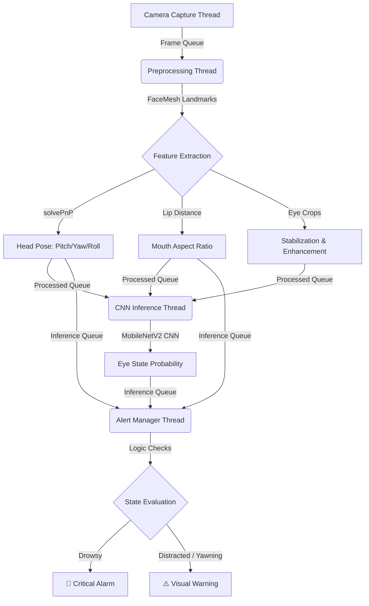

# Driver Drowsiness Detection Pipeline

A real-time driver drowsiness detection system using computer vision and deep learning. The pipeline processes camera frames through multiple stages: face detection, eye tracking, drowsiness classification, and alerting.

## Features

- **Real-time Processing**: Multi-threaded async pipeline with zero-deadlock synchronization.
- **Advanced Face Tracking (FaceMesh)**: Dense 468 3D facial landmarks for precise tracking.
- **Head Pose Estimation**: Pitch, Yaw, and Roll calculation using `cv2.solvePnP` for distraction monitoring.
- **Yawning Detection**: Mouth Aspect Ratio (MAR) computed from lip landmarks.
- **Drowsiness Detection (MobileNetV2)**: State-of-the-art CNN for evaluating Eye State probabilities.
- **Automatic Mixed Precision (AMP)**: GPU optimization using PyTorch `autocast`.
- **Model Training Suite**: Integrated `train.py` and `dataset.py` for retraining on public datasets.

## Pipeline Architecture



## Requirements

```
opencv-python>=4.5.0
numpy>=1.19.0
mediapipe>=0.8.0
torch>=1.9.0
playsound>=1.3.0
```

Install dependencies:
```bash
pip install opencv-python numpy mediapipe torch playsound
```

## Usage

```bash
python main.py
```

## Configuration

Edit `config.py` to customize:

| Parameter | Description | Default |
|-----------|-------------|---------|
| `CAMERA_ID` | Camera device ID | 0 |
| `CAMERA_WIDTH` | Frame width | 640 |
| `CAMERA_HEIGHT` | Frame height | 480 |
| `EAR_THRESHOLD` | Eye aspect ratio threshold | 0.2 |
| `CLOSED_FRAMES_THRESHOLD` | Frames for closed eye detection | 15 |
| `USE_CUDA` | Enable GPU acceleration | False |

## Project Structure

```
.
├── config.py                 # Configuration and hyperparameters
├── main.py                   # Main pipeline orchestration
├── pipeline/
│   ├── capture.py            # Camera capture module
│   ├── preprocessing.py      # Face detection & image enhancement
│   ├── inference.py          # CNN inference pipeline
│   └── alerting.py           # Alert management
└── models/                   # Model weights (add your models here)
```

## License

MIT License
